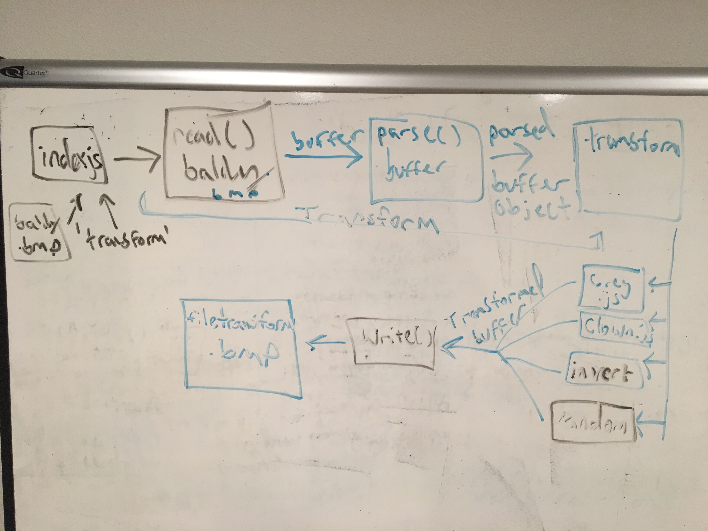
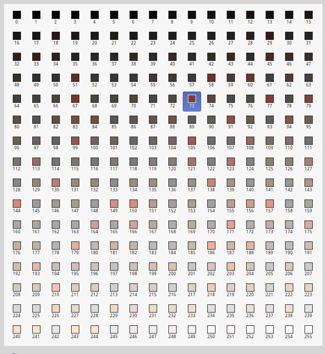

 LAB 5
=================================================

## Buffers and Bitmap Manipulation

### Author: Chris Merritt and Aaron Ferris 

### Links and Resources
* [Pull Request](https://github.com/codefellows-js-401d29-aaron-ferris/Buffers/pull/3)
* [travis](https://www.travis-ci.com/codefellows-js-401d29-aaron-ferris/Buffers)

#### Documentation
* [jsdoc](http://xyz.com) (All assignments)

### Modules
#### `index.js`
##### Exported Values and Methods

###### `export: Bitmap Object`
* Initially created from first file brought in
* modified with functions detailed below
* written to a new file name in the assets folder.

###### `read()`
* utilizes fs.readfile
* inputs: file, error, buffer
* outputs: throw an error, or run the parse function on the buffer that is read from file

###### `parse()`
* defines the offsets for the table, the buffer for the table, and defines the color table and the pixel array from the initial buffer
* inputs: buffer
* calls the transform function
* calls the writefile function

###### `transform()`
* inputs: operation, buffer
* outputs: depending on desired operation, calls corresponding js file in order to transform the buffer

###### `write()`
* utilizes fs.writeFile
* inputs: file, buffer
* outputs: utilizes object's newfile, writes it to a new file name, or throws an error

#### `clown.js`
##### Exported Values and Methods

###### `export: clown`
* buffer created from its transform function. 
* Has .name of clown

###### `transform`
* takes in Buffer, gives back a modified buffer.
* First checks if it is a buffer
* defines pixelmap as part of the array, and the width of the image in pixels
* redefines all places that reference 244 (skin color) onthe pixel pallet as their value and redefines it to 255 (white)
*for the left and the right eye, redefines the pixels 3 pixels wide for a few rows up and down as 0 (black)

#### `invert.js`
##### Exported Values and Methods

###### `export: invert`
* Buffer created from its transform function. 
*  Has .name of invert

###### `transform`
* takes in Buffer, gives back a modified buffer.
* First checks if it is a buffer
* defines color pallate as part of the buffer,
* Each color input on the pallate has a R G B A value. uses a for loop that iterates every four and changes the first three values to 255-value

#### `greyscale.js`
##### Exported Values and Methods

###### `export: grey`
* Buffer created from its transform function. 
*  Has .name of grey

###### `transform`
* takes in Buffer, gives back a modified buffer.
* First checks if it is a buffer
* defines color pallate as part of the buffer.
* Each color input on the pallate has a R G B A value. uses a for loop that iterates every four averages the value of them and outputs that value for each one of the R G B values.

#### `random.js`
##### Exported Values and Methods

###### `export: invert`
* Buffer created from its transform function. 
*  Has .name of invert

###### `transform`
* takes in Buffer, giives back a modified buffer.
* First checks if it is a buffer
* defines color pallete as part of the buffer,
* Each color input on the pallate has a R G B A value. uses a for loop that iterates every four and changes the first three values to their own random value.

### Setup
#### `.env` requirements
* `npm init`
* you will need node in order to run this
* setup your package.json file's scripts to look like this 
  * __"  "scripts": {__
  *   __"start": "node index.js",__
  *   __"lint": "eslint **/*.js",__
  *   __"test": "jest --verbose --coverage",__
  *   __"test-watch": "jest --watchAll --verbose --coverage",__
  *   __"jsdoc": "jsdoc -c ./docs/config/jsdoc.config.json"__
  * __},__
* `npm i jest eslint jsdocs fs`
* should you make a new transform, set it in the lib folder.
#### Running the app
* Things to know about your input for making transforms:
  * We are modifying a 8 bit file. major overhaul will be needed for any other sort of file
  * The 8bit file has a few offsets to take note of.
    * All header information (non color/pixel information) goes through 53
    * color pallate goes from 54 to 1145
    * from 1145 to the length of the buffer makes up the pixel references
  * The color pallate is read LE (little endian) style and is offset to the back. 4 bits makes up a single color in  (A R G B when read LE style)
* the transforms are made to look good with specifically the baldy.bmp. Should you want to do the same to other documents, you will have to find values to change. 
* The ones that might work univerally are greyscale, invert and random
* to run the file:
  * first navigate to the base of your directory
  * type `node index.js /assets/filename operation`
* Endpoint: `./assets/`
  * Returns a BMP file that has been modified

#### Tests
* Tests utilize mockindex.js to run the files
* MockIndex.js
  * Shoul accept a file to read
  * should transform a buffer
  * should write a file
  * should return null if the file is not valid
  * should return null if the function is not valid
  * should return null if the buffer is not returned

* each transform (clown, invert, grey, random)
  * should return a buffer
  * should return null for a number (input)
  * should return null for an array (input)
  * should return null for an object (input)
  * should return null for a boolean (input)

#### UML

#### Reference:

#### Resulting Transformations and Exact Commands
* Mime John  
* node index.js assets/baldy.bmp clown

* Random Color John  
* node index.js assets/baldy.bmp random  

* Grey John  
* node index.js assets/baldy.bmp grey

* Inverted John  
node index.js assets/baldy.bmp inverted

#### Defined Color Pallate for John Bitmap

